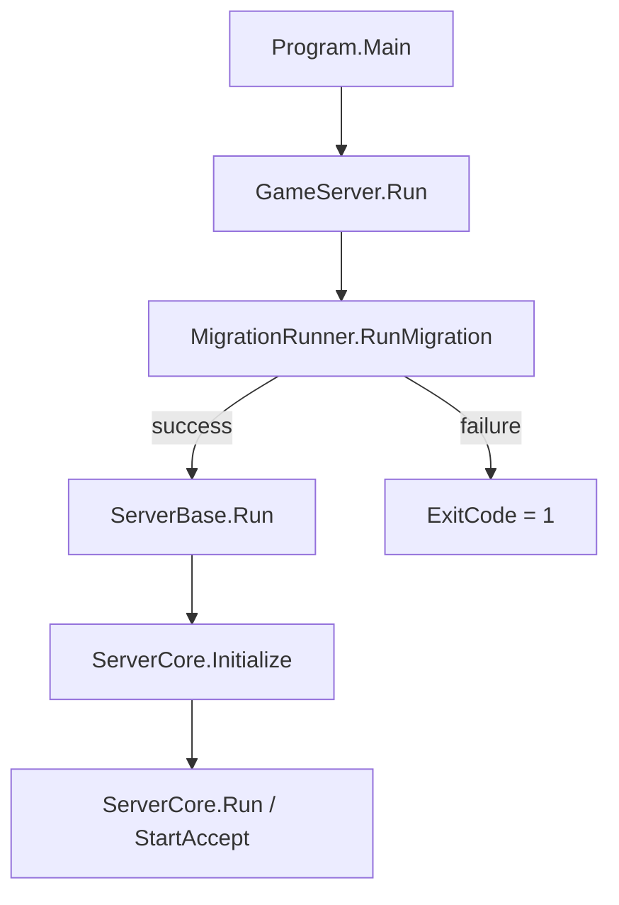
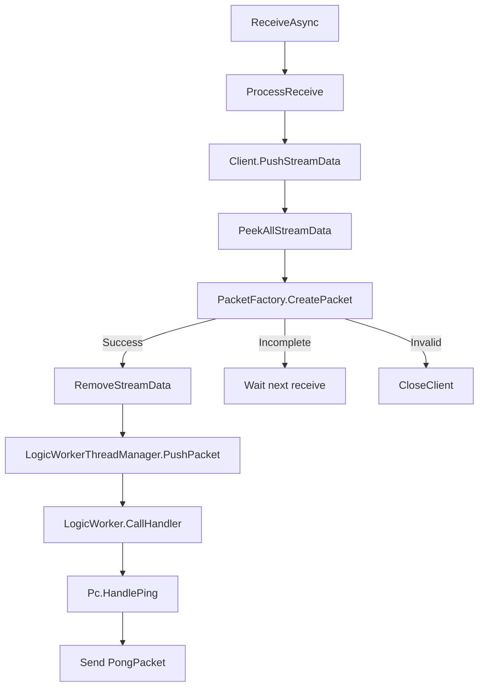
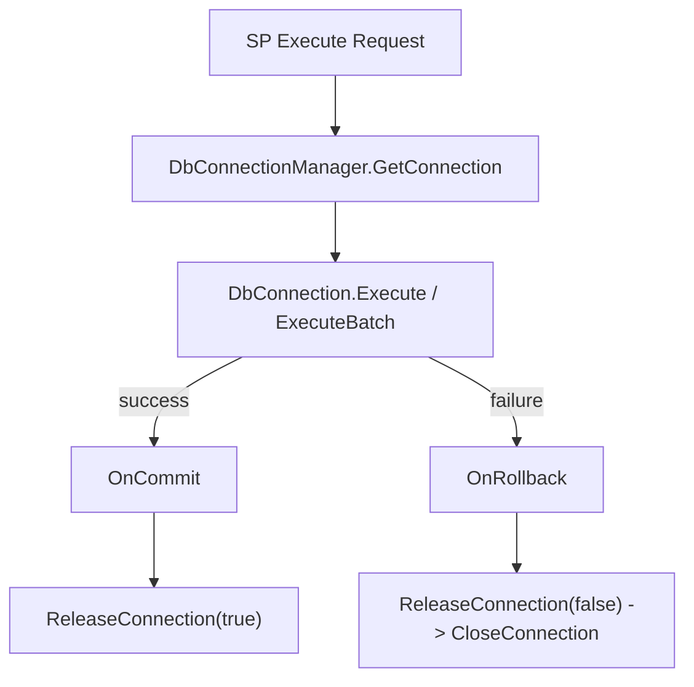

# Diagrams

## 서버 시작 흐름

```mermaid
flowchart TD
    Main["Program.Main"] --> GameServer["GameServer.Run"]
    GameServer --> Migration["MigrationRunner.RunMigration"]
    Migration -->|success| BaseRun["ServerBase.Run"]
    Migration -->|failure| Exit["ExitCode = 1"]
    BaseRun --> Init["ServerCore.Initialize"]
    Init --> Listen["ServerCore.Run / StartAccept"]
```

## 수신과 패킷 처리 흐름

```mermaid
flowchart TD
    Recv["ReceiveAsync"] --> ProcessReceive["ProcessReceive"]
    ProcessReceive --> Push["Client.PushStreamData"]
    Push --> Peek["PeekAllStreamData"]
    Peek --> Factory["PacketFactory.CreatePacket"]
    Factory -->|Success| Remove["RemoveStreamData"]
    Factory -->|Incomplete| WaitMore["Wait next receive"]
    Factory -->|Invalid| Close["CloseClient"]
    Remove --> Queue["LogicWorkerThreadManager.PushPacket"]
    Queue --> Worker["LogicWorker.CallHandler"]
    Worker --> Ping["Pc.HandlePing"]
    Ping --> Pong["Send PongPacket"]
```

## DB 실행 흐름

```mermaid
flowchart TD
    Start["SP Execute Request"] --> GetConn["DbConnectionManager.GetConnection"]
    GetConn --> Execute["DbConnection.Execute / ExecuteBatch"]
    Execute -->|success| Commit["OnCommit"]
    Execute -->|failure| Rollback["OnRollback"]
    Commit --> Release["ReleaseConnection(true)"]
    Rollback --> Dispose["ReleaseConnection(false) -> CloseConnection"]
```

## 관련 문서

- [[Core/ServerLifecycle]]
- [[Core/Networking]]
- [[DB/Database]]
